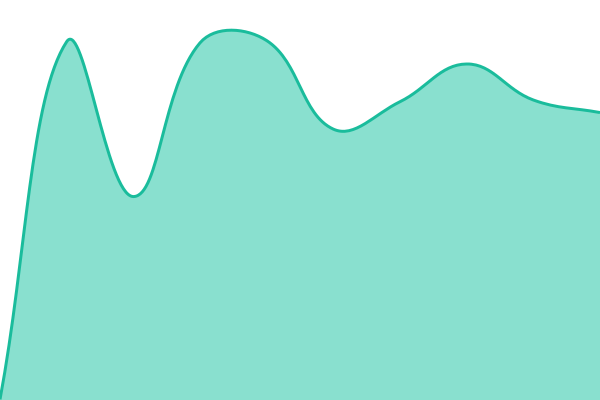
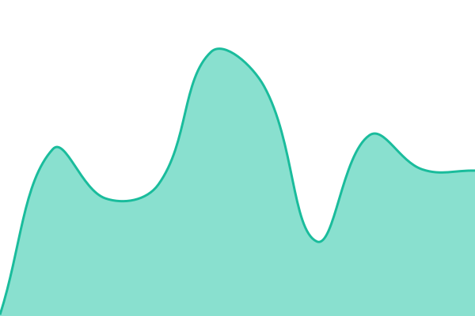
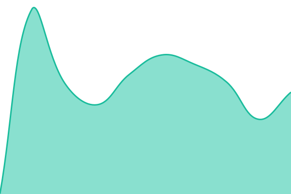

# Open Waters status

Uptime monitor and status page for [Open Waters](https://openwaters.io) services, powered by [Upptime](https://upptime.js.org) on GitHub Actions, Issues, and Pages. The page is at [status.openwaters.io](https://status.openwaters.io); downtime opens an issue here.

Monitors live in [.upptimerc.yml](.upptimerc.yml). `AIS stream` checks `https://ais.openwaters.io/health`, which is 503 when an open-feed upstream is silent or the server's own subscriber stops receiving events, so it covers delivery, not just reachability.

<!--start: status pages-->
<!-- This summary is generated by Upptime (https://github.com/upptime/upptime) -->
<!-- Do not edit this manually, your changes will be overwritten -->
<!-- prettier-ignore -->
| URL | Status | History | Response Time | Uptime |
| --- | ------ | ------- | ------------- | ------ |
|  [AIS stream](https://ais.openwaters.io/health) | 🟥 Down | [ais-stream.yml](https://github.com/openwatersio/status/commits/HEAD/history/ais-stream.yml) | 

 480ms
     
 | 

<a href="https://status.openwaters.io/history/ais-stream">85.24%</a>
    

|  [AIS WebSocket](wss://ais.openwaters.io/v1/stream) | 🟩 Up | [ais-web-socket.yml](https://github.com/openwatersio/status/commits/HEAD/history/ais-web-socket.yml) | 

 0ms
     
 | 

<a href="https://status.openwaters.io/history/ais-web-socket">100.00%</a>
    

|  [AIS vessels snapshot](https://ais.openwaters.io/v1/vessels?bbox=59,10,60,11) | 🟩 Up | [ais-vessels-snapshot.yml](https://github.com/openwatersio/status/commits/HEAD/history/ais-vessels-snapshot.yml) | 

 848ms
     
 | 

<a href="https://status.openwaters.io/history/ais-vessels-snapshot">100.00%</a>
    

|  [AIS live map](https://openwatersio.github.io/aiscast/) | 🟩 Up | [ais-live-map.yml](https://github.com/openwatersio/status/commits/HEAD/history/ais-live-map.yml) | 

 113ms
     
 | 

<a href="https://status.openwaters.io/history/ais-live-map">100.00%</a>
    

|  [openwaters.io](https://openwaters.io) | 🟩 Up | [openwaters-io.yml](https://github.com/openwatersio/status/commits/HEAD/history/openwaters-io.yml) | 

 150ms
     
 | 

<a href="https://status.openwaters.io/history/openwaters-io">100.00%</a>
    

<!--end: status pages-->
