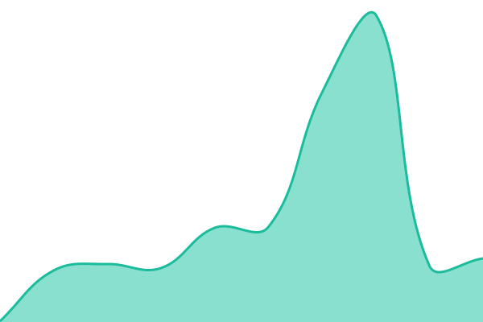
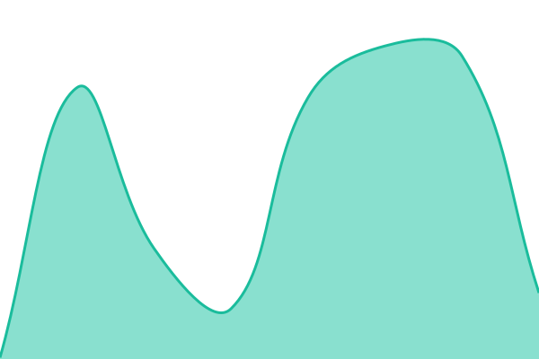
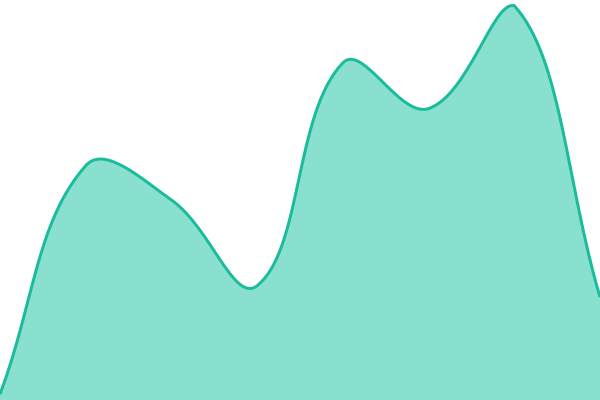

# Open Waters status

Uptime monitor and status page for [Open Waters](https://openwaters.io) services, powered by [Upptime](https://upptime.js.org) on GitHub Actions, Issues, and Pages. The page is at [status.openwaters.io](https://status.openwaters.io); downtime opens an issue here.

Monitors live in [.upptimerc.yml](.upptimerc.yml). `AIS stream` checks `https://ais.openwaters.io/health`, which is 503 when an open-feed upstream is silent or the server's own subscriber stops receiving events, so it covers delivery, not just reachability.

<!--start: status pages-->
<!-- This summary is generated by Upptime (https://github.com/upptime/upptime) -->
<!-- Do not edit this manually, your changes will be overwritten -->
<!-- prettier-ignore -->
| URL | Status | History | Response Time | Uptime |
| --- | ------ | ------- | ------------- | ------ |
|  [Google](https://www.google.com) | 🟩 Up | [google.yml](https://github.com/upptime/upptime/commits/HEAD/history/google.yml) | 

 139ms
     
 | 

<a href="https://demo.upptime.js.org/history/google">99.66%</a>
    

|  [Wikipedia](https://en.wikipedia.org) | 🟩 Up | [wikipedia.yml](https://github.com/upptime/upptime/commits/HEAD/history/wikipedia.yml) | 

 137ms
     
 | 

<a href="https://demo.upptime.js.org/history/wikipedia">100.00%</a>
    

|  [Hacker News](https://news.ycombinator.com) | 🟩 Up | [hacker-news.yml](https://github.com/upptime/upptime/commits/HEAD/history/hacker-news.yml) | 

 228ms
     
 | 

<a href="https://demo.upptime.js.org/history/hacker-news">100.00%</a>
    

|  Secret Site | 🟩 Up | [secret-site.yml](https://github.com/upptime/upptime/commits/HEAD/history/secret-site.yml) | 

 42ms
     
 | 

<a href="https://demo.upptime.js.org/history/secret-site">100.00%</a>
    

<!--end: status pages-->
